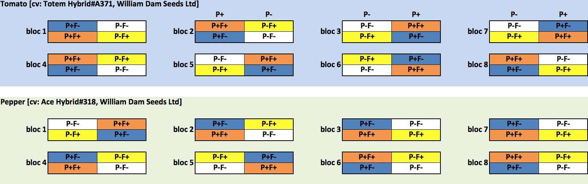

	 
\newpage 


#INTRODUCTION  
Seaweeds (also known as marine algae) have been used as a source of organic matter and nutrients for centuries, especially in coastal areas [@khan2009seaweed;@craigie2011seaweed]. Originally, farmers would simply collect and dry algae before directly applying them to the field to decompose naturally prior to seeding in the spring. Liquid seaweed extracts, developped in the 1950s in order to concentrate plant growth-stimulating compounds, facilate their usage in modern agricultural crop production systems @milton1952improvements. Today, most commercially available seaweed extracts are made using a high temperature and pressure alcaline extraction technique from brown algae such as *Ascophyllum nodosum*, *Ecklonia maxima* or *Laminaria spp*.  
&nbsp;   
One of the main advantages of seaweed extracts is that they are biodegradable, non-toxic and come from a renewable resources, unlike modern chemical fertilizers @dhargalkar2005seaweed. As such, they are commonly used as a natural fertilizer and source of phytohormones in organic and sustainable agricultural systems @craigie2011seaweed. However, the specific molecular mechanisms underlying their mode-of-action and their effect on plant growth and productivity are complex and not well understood. In fact, scientific research into their mode-of-action on plant growth and their effect on root associated microbial and fungal communities is still in its infancy [@khan2009seaweed;@alam2013ascophyllum]. In turn, this likely precludes a greater acceptance of liquid seaweed extracts as a viable and renewable alternative to limit the use of modern fertilizers and pesticides in agriculture.  
&nbsp;   
Studies on liquid seaweed extracts have been conducted to bettter understand how seaweed extracts might ultimately boost plant productivity [e.g.: @khan2009seaweed;@alam2013ascophyllum;@alam2013effect;@wally2013regulation;@arioli2015applications] and a large number of phytohormones which can influence physiological processes even at very low concentrations, have been identified. Auxins, cytokinins, abscissic acid or gibberellins are all phytohormones present in seaweed extracts and which are hypothesized to trigger disease response pathways and increase stress tolerance in plants [@arioli2015applications;@stirk2014plant]. Yet, @wally2013regulation concluded that phytohormone levels present within the extracts themselves were insufficient to cause significant effects in plants when applied at recommended rates. Instead, bioactive components within seaweed extracts themselves such as vitamins, oligosaccharides, and micronutrients may directly modulate the plant endogeneous biosynthesis pathways of phytohormones. Nevertheless, the basis for these benefits is complex and still relatively poorly understood [@arioli2015applications;@stirk2014plant].   
&nbsp;  
Concurrently, it is hypothesized that the application of seaweed extract may also alter microbial and fungal communities. This is turn, could explain the improved plant performance often observed when seaweed extracts are applied to agricultural soil [@santoyo2012mechanisms;@alam2013ascophyllum;@alam2013effect]. For example, @alam2013ascophyllum demonstrated that the applicatio of *Ascophyllum* extracts increased root associated microbial activity while promoting plant growth and root yield in carrots. Similarly, @alam2013effect showed that seaweed extracts increased strawberry root and shoot growth, berry yield and rhizosphere microbial diversity. While promising, these studies come with two major caveats. First, corellation does not imply causation, and the molecular mechanisms behind the observed seaweed extract - bacterial diversity - plant productivity relationship was not identified precisely. Second, these studies required culturing bacteria *in vitro*, a labour intensive approach targetting a small (and biased) fraction of the total communities. Given the vast diversity of microbial populations, studies on the functional activity of complex soil microbial communities remain challenging.  
&nbsp;     
The recent development of culture-independent molecular techniques should therefore permit to circumvent the inherent bias of culture based approaches by targeting the ubiquitous component of life, its DNA. In turn, this should permit to identify a larger proportion of the bacterial diversity and lead to a better understanding of the soil microbial response to seaweed extract. DNA barcoding targeting the internal transcribed spacer (ITS) region of the nuclear ribosomal repeat and the bacterial V3-V4 region of the 16S ribosomal gene for fungi and bacteria, respectively, are now regarded as a prerequisite procedure to comprehensively understand the diversity and ecology of microbial organisms [@toju2012high;@klindworth2013evaluation]. Once this is performed, further studies for example using inoculum of microbial species linked to the presence of liquid seaweed extract may help to identify a causative link between extracts, microbes and productivity.  
&nbsp;   
The aim of the current project was to quantify the impact of seaweed (*Ascophyllum nodosum*) extracts on plant growth. In addition, we tested how the bacterial and fungal communities responded to the addition of theses extracts. We hypothesized that the inclusion of liquid seaweed extracts would improve productivity and alter significantly the bacterial and fungal communities. We used a a commercially available extract (Stella Maris®) derived from fresh *Ascophyllum nodosum* algae harvested from the nutrient-laden waters of the North Atlantic off the Eastern Coast of Canada. We tested the effect of these extract on two commonly used plants (Tomato - *Solanum lycopersicum* and Pepper - *Capsicum annuum*) using different measures of productivity and by measuring soil and root bacterial anf fungal diversity using High Througput Illumina Miseq sequencing.  
&nbsp;
&nbsp;  

#MATERIAL AND METHOD  
*Study design*  
Two greenhouse experiment were set up in large trays (60x30x18 cm) in November (tomato [cv: Totem Hybrid#A371, William Dam Seeds Ltd]) and December (Pepper [cv: Ace Hybrid#318, William Dam Seeds Ltd]) 2015. Soil was collected from an agricultural field under organic regime at the IRDA research station in St-Bruno (Qc, Canada) on October 7^th^ 2015 (loamy sand soil, 15 cm top layer collected). Soil characteristics (pH, conductivity, nutrients, see Table 1) were measured by AgriDirect (Longueuil, Qc, Canada).    
&nbsp;  
For each species tested (Tomato - *Solanum lycopersicum*, Pepper - *Capsicum annuum*), a randomized split block design (Figure 1) was used with four trays set up per block (eight blocks). Half of the trays were fertilized (fertilization treatment), as described below. Half of the trays were also planted with four replicate plants each, while the other trays were left bare. This allowed a direct comparison of the fungal and bacteria soil communities with respect to the fertilization and planting treatment. 
&nbsp;  
{width=600px}   
**Figure 1: experimental design**  
&nbsp;  
Half of the tomato plants were fertilized using multipurpose organic fertilizer (pure hen manure, 18 g per tray repeated every 4 weeks, 5-3-2) from Acti-sol (Notre-Dame-du-Bon-Conseil, Qc, Canada) in addition to Stella Maris® (3.5 ml per 1L, each tray received 250 ml, repeated every 2 weeks) for the duration of the experiment. The other half were unfertilized. Stella Maris® is a registered trademark from Acadian Seaplants Ltd. (Darmouth, NS, Canada). It is primarily composed of *Ascophyllum nodosum* seaweed and is advertized as a natural activator of the crops' own growth and defense mechanisms to improve root growth and resist temperature, drought, and salinity stress in order to maximize yield and crop qualities (Acadian Seaplants Ltd. 2018). Half of the pepper plants were treated using solely Stella Maris (3.5 ml per 1L, each tray received 250 ml, repeated every 2 weeks) for the duration of the experiment. The other half were untreated.
&nbsp;  
Thrips were managed with *Neoseiulus cucumeris* (syn. *Amblyseius cucumeris*) (100 bags), Fungus gnat and thrips were also controlled using predatory mite *Gaeolaelaps gillespiei* (1L). Plants were treated once a week with Oïdium Milstop to control the fungus.  
&nbsp;  
&nbsp;  
*Plant productivity*  
At the end of the experiment, plant productivity was assessed by measuring four different traits (fruit number, average fruit weight, shoots fresh weight, roots fresh weight) on three plants chosen randomly per tray (for each treatment [fertilization/control], species [tomato/pepper] and block [eight blocks]) for a total of 96 samples. In addition, both shoots and roots were dried in a 70 degrees drying oven, and dry weights were measured after 48 hours. Together, these traits are expected to represent well the plant overall productivity.  
&nbsp;   
&nbsp;  
*Sample preparation, DNA extraction and High throughput sequencing*  
We sampled both the microbial and fungal communities from soil and root samples. Soil DNA was extracted using XXX DNA isolation kit with YYY g of soil. Roots were first washed with sterile water and DNA was extracted using XXX DNA isolation kit with YYY g of root samples. Amplicon sequencing targeting 16S rRNA gene (bacteria) and ITS (fungi) was performed on both root and soil samples.    
&nbsp;  
In order to target fungi specifically, we used fungal primers ITS3_KYO2 (5'-ACACTGACGA CATGGTTCT ACAGATGAAGAAC GYAGYRAA-3') and ITS4_KYO3 (5'-TACGGT AGCAGAGACTT GGTCTCTBTTV CCKCTTCACTCG-3') to produce a final amplicon size of ~430bp. This primer pair should target the Internal transcribed spacer and inhibit the amplification of plant sequences and enable the selective amplification of fungal communities from soil, mycorrhizal and other environmental samples @toju2012high.  
&nbsp;  
Bacterial primers 341F (5'-CCTACGGG NGGCWGCAG-3') and 805R (5'-GACTACC AGGGTATC TAATC-3') producing a final amplicon size of ~464b and targeting specifically the bacterial V3-V4 region of the 16S ribosomal gene were chosen. This primer pair has been used extensively in high-throughput sequencing studies in a range of environments and was shown to be the least biased among 512 primer pairs evaluated in silico for bacterial amplification @klindworth2013evaluation.  
&nbsp;  
DNA samples were then barcoded, pooled and sequenced (2X300bp, paired-end) using an Illumina MiSeq (San Diego, CA, USA) sequencer at the Genome Quebec Innovation Centre (Montreal, Canada). Sequences were demultiplexed by the sequencing facility (Genome Quebec Innovation Centre) and further processed as described below.  
&nbsp;  
&nbsp;  
*Bioinformatics*  
All bioinformatics, statistical, and graphical analyses further described were performed in R 3.5.1 @team2018r and detailed scripts are available here (https://github.com/seb951/Acadian_Seaplants).  
&nbsp;  
We used the `R` package `dada2` @callahan2016dada2 to infer *Amplicon Sequence Variants (ASVs)*. `Dada2` offers accurate sample inference from amplicon data with single-nucleotide resolution in an open source environments. Unlike the Operational Taxonomic Unit (OTU) approach (e.g. @schloss2009introducing, @caporaso2010qiime), ASV are not treated as cluster of sequences defined with an *ad hoc* sequence similarity threshold. Instead, after sequences are quality trimmed and error-corrected, `dada2` reveals the unique members of the sequenced community, thus allowing sequences and abundance counts to be compared among studies @callahan2016dada2.  
&nbsp;  
First, sequences were trimmed following strict quality thresholds (removing primers and low quality nucleotides, see parameter details in the accompanying `R` scripts). Following this, we applied the error model algorithm of `dada2` which incorporates quality information after filtering, unlike other OTU based methods. Then dereplication, sample inference, merging of paired end reads and removal of chimera reads were performed in order to obtain a sequence (ASVs) table of abundance per sample. Taxonomy was also assigned using the Ribosomal Database Project (RDP) Naive Bayesian Classifier algorithm from @wang2007naive. Depending on support (minimum bootstrap support of 80), we assigned taxonomy from Kingdom to species. We used the silva database formatted for `dada2` to infer bacterial taxa @silva. We used the @UNITE2017 fasta release (including singletons) to infer fungal taxa after formatting it to the `dada2` format using a custom `R` script. The pipeline was run on a multithreaded (48 CPUs) computer infrastructure provided by Westgrid (https://www.westgrid.ca/support/systems/cedar) and Compute Canada (www.computecanada.ca). Note that the pipeline was run separately for fungal-root, fungal-soil, bacteria-soil and bacteria-root samples given the markedly different nucleotide compositions of the sequenced amplicons, unique taxa and specific error models of each dataset.
&nbsp;  
&nbsp;  
*Statistical analyses - plant productivity*  
We tested for the effect of species (tomato vs pepper), fertilization and their interaction on six plant productivity measures (fruit number, average fruit weight, shoots fresh weight, roots fresh weight, shoots dry weight, roots dry weight). We used linear mixed effect models (LMM) in the R package `nlme` @pinheiro2017nlme, which are more appropriate than an Analysis of Variance (ANOVA) given the current block design (blocks and replicates nested within a block were treated as random variables). All six plant productivity measures were either square root or log transformed in order to help satisfy the assumption of normality of the residuals in the LMM statistical framework. For the variables *fruit number* and *average fruit weight*, we also used a permutation-based 2-way ANOVA (@anderson1999empirical) given that the residuals of the LMM were not normally distributed (results were similarly significant).      
&nbsp;  
&nbsp;  
*Statistical analyses - microbial and fungal diversity*  
We analysed separately fungal-root, fungal-soil, bacterial-root and bacterial-soil ASV diversity. For each of these four datasets, we removed samples that showed poor sequencing output and contained few ASVs. In order to do this, we summed the abundance of all ASVs for each sample ($\sum_{i=1}^n ASV$) and eliminated samples that had fewer that the mean sum ($\overline{\sum_{i=1}^n ASV}$) - 4$\sigma$ (four standard deviations). In addition, we removed ASVs from our dataset that were present in fewer than 5% of the samples (less than ten individuals in the soil samples, and less than five in the root samples). This was done to remove very rare ASVs unique to a block or replicate, but not found in the majority of a treatment and keep only *abundant* ones.  
&nbsp;    
We then conducted community-based analyses looking at the effect of the fertilization treatment on the abundant ASV taxa in the tomato and pepper experiments. To reduce the complexity of the datasets, relative abundance of all taxa were calculated per family using the `R` package `dplyr` @wickham2015dplyr. Barplots were drawn using `ggplot2` @wickham2016ggplot2 to vizualize communities. ASV ($a$)-diversity was calculated for each sample using the inverse Simpson diversity index in `vegan` @oksanen2013package. The effect of fertilization treatment, species (and planting for soil communities) were assessed using a linear mixed-effect (LMM) model in the R package `nlme` @pinheiro2017nlme, given the unbalanced, replicated block design. Alpha diversity was log transformed in order to help satisfy the assumption of normality of the residuals of the LMM statistical framework.  
&nbsp;  
Using the community matrix data of ASVs abundance, we performed PERmutational Multivariate ANalysis Of VAriance tests (PERMANOVA; @anderson2001new) to identify relationships between the communities according to the experimental design. ASV abundance data was Hellinger-transformed and significance was assessed using 10,000 permutations in `vegan` @oksanen2013package. Blocks and replicates nested within blocks were factored as strata (blocks) in the model.  
&nbsp;    
We also performed canonical correspondence analyses (CCAs) using Hellinger-transformed ASV abundance data in `vegan` @oksanen2013package to visually assess the grouping of samples, ASVs and their association with productivity variables (*species* scaling based on ASV matrix). Data were analysed separately for fungal-root, fungal-soil, bacterial-root and bacterial-soil, but also according to species (tomato/pepper), given that analyses of $a$ diversity showed that tomato and pepper were markedly different. This gave a total of eight CCAs. Data were constrained based on four of the productivity measures (fruit number, average fruits weight, shoots fresh weight, roots fresh weight). We excluded the shoot & root dry weights as constraints to simplify the model and given that they were highly correlated with the fresh weigth already included as constraints ($r^2$=0.98 and 0.76 for shoot dry/fresh weights and root dry/fresh weights, respectively).  &nbsp;    
&nbsp;    
Finally, we attempted to identify candidate ASVs positively associated with productivity. As such, we  identified the ten ASVs most positively associated with the measures of fruit number, shoots fresh weight and roots fresh weight from each canonical correspondence analysis for a total of 40 fungal and 40 bacterial candidates ASVs. We aligned candidate sequences from these candidates ASVs using the Bioconductor `R` package `decipher` @wright2016using and build pairwise distances matrices using a JC69 substitution models of DNA sequence evolution (equal base frequencies, @jukes1969evolution) in `phangorn` @schliep2010phangorn. Phylogenetic trees for bacteria and fungi were plotted using `ape` @paradis2004ape. This permitted to identify if similar candidate ASVs were found under different experimental conditions (soil/root, pepper/tomato), thus reinforcing their role in productivity increase, and decreasing the change that these are false positive.  
&nbsp;    &nbsp;  
  
\newpage  

#RESULTS  
  
*Soil characteristics*  
In Table 1, we present the characteristics of the soil which was collected at the IRDA research station in St-Bruno (Qc, Canada) and used in the current experimental design.  
&nbsp;    
```{r soilcharac, echo=F}
library(knitr)
permanova.summary = read.table("../results/nutrients.csv",sep = ",", header = T)
colnames(permanova.summary) = sub("."," ",colnames(permanova.summary),fixed =T)
kable(permanova.summary,digits =4,caption = "Soil characteristics")
```   

&nbsp;     

*productivity*  
We tested the effect of the fertilization treatment on six measures of overall plant growth and productivity (fruit number, average fruit weight, shoots fresh weight, shoots dry weight, roots fresh weight, roots dry weight) for both tomato and peppers. Visually, both above ground and below ground plant structure grew larger in fertilized plants, in addition to producing more fruits (see Figure 2 for some examples of the striking difference between fertilized and unfertilized plants). 
&nbsp;  
{width=500px}  
**Figure 2: Plant productivity. Photos were taken at the end of the experimental treatment. In each photo, fertilized plants are on the left. A: pepper plants, B: pepper roots, C: pepper fruits and D: tomato fruits.**  
&nbsp;  
Statistically, all six productivity measures significantly differed according to species, and five of those were significantly different according to the fertilization treatment. The only exception was the average fruit weight which did not differ between fertilized and control plants (LMM, $F_{(1,69)}$ = 1.27, *p*-value=0.26). However the model did reveal a significant interaction between treatment and plant ($F_{(1,69)}$ = 9.6, *p*-value=0.0028). In fact, when testing only the pepper plants, the effect of fertilization on average fruit weight was significantly higher in the fertilized pepper plants ($F_{(1,23)}$ = 10.84, *p*-value=0.0032).  
&nbsp;  
{width=600px}  
**Figure 3: measures of plant productivity.**  
&nbsp;  
&nbsp;  
*Sequencing*  
A total of 2.7 million paired-end raw reads were obtained for all samples combined (976,000 for fungi-soil, 920,000 for fungi-root, 309,000 for bacteria-soil and 535,000 for bacteria-root, Table 2). Note that sequencing samples were analysed separately for fungal-soil, fungal-root, bacteria-soil and bacteria-root conditions. On average, 47,664 paired-end reads were obtained per sample. After quality filters were applied, including removing chimeras, and paired-end reads were merged, an average of 19,690 sequences remained per sample. While 192 soil samples for fungi and bacteria, and 96 root samples for fungi and bacteria were sequenced, seven fungi-soil samples, 15 fungi-root samples and one bacteria-root samples were removed because they had to few reads based on our strict quality thresholds.  
&nbsp;  
The `dada2` pipeline infered, on average, 170 Amplicon Sequence Variants per sample (average of 176 fungal-soil ASV, 37 fungal-root ASVs, 269 bacterial-soil ASVs and 92 bacterial-root ASVs). Many of those were unique to one of a few samples (total number of 6,112 fungal-soil, 845 fungal-root, 9,352 bacterial-soil and 2,023 bacterial-roots ASVs). After quality filtering ASVs that were found in fewer than 10% of the samples, we retained 413, 106, 811 and 325 ASVs and which comprised 94%, 95%, 89% and 98% of all reads in the fungal-soil, fungal-root, bacterial-soil and bacterial-root samples, respectively.  
&nbsp;  
&nbsp; 
```{r summary Table2, echo=F}
library(knitr)
summary.table=read.table("../results/summary.table",header = T,row.names = 1)
colnames(summary.table)[2] = "Nb_seq_sum"
summary.table[,2] = summary.table[,2]*1000
summary.table=t(summary.table[c(4:1),])
summary.table[1,] = c(192,96,192,96)
summary.table = summary.table[c(2:6,1,9,8,10,7),]
kable(summary.table,format.args=list(big.mark = ','), digits =4,caption = "Sequencing and ASV summary")
```  

&nbsp;  
&nbsp;  
*Root, soil, microbial and bacterial diversity*  
We then analysed the whole community structure and report the relative abundance of taxa (family) for the fungal-soil, fungal-root, bacteria-soil and bacteria-root conditions (Figure 4). Fungal communities were dominated by Nectriaceae, both in the root and soil samples. The bacterial family Bacilaceae dominated to a lesser extent the soil communities. Bacterial root communities were largely dominated by the Cyanobacteria phylum (identified as *chloroplast* according to the Ribosomal Database Project Naive Bayesian Classifier and the silva database). In fact, these ASVs are likely sequenced chloroplasts from the plants themselves, despite the fact that the primer pair used should have primarly targeted the bacterial V3-V4 region of the 16S ribosomal gene.     
&nbsp;  
{width=700px}  
**Figure 4a: Barplots fo the relative abundance of fungal ASVs for fungi**  
&nbsp;
&nbsp;  
{width=700px}  
**Figure 4b: Barplots fo the relative abundance of bacterial ASVs for bacteria**  
&nbsp;
&nbsp;  
*Local ($a$-diversity)*  
The diversity of each site ($a$-diversity) was calculated seperately for each sample and under each experimental conditions (fungi-soil, fungi-root, bacteria-soil and bacteria-root, Figure 5). Linear mixed effects models were used to assess significance. In soil samples, fungal diversity did not differ with respect to the fertilization ($F_{(1,161)}$=0.17, *p*-value=0.6853), but did so with respect to planting ($F_{(1,161)}$=9.00, *p*-value<0.0032) treatment and species ($F_{(1,161)}$=13.03, *p*-value=0.0003). In root samples, fungal diversity differed with respect to the fertilization treatment ($F_{(1,56)}$=10.1, *p*-value=0.003), and the species tested ($F_{(1,56)}$=4.5, *p*-value=0.04). In soil samples, bacterial diversity differed with respect to the fertilization treatment ($F_{(1,165)}$=17.13, *p*-value<0.0001), planting ($F_{(1,165)}$=139.0, *p*-value<0.0001) but not species ($F_{(1,165)}$=1.89, *p*-value=0.17). In root samples, bacterial diversity differed with respect to the fertilization treatment ($F_{(1,67)}$=17.27, *p*-value=0.0001), and the species tested ($F_{(1,67)}$=359.69, *p*-value<0.0001).
&nbsp;  
{width=600px}  
**Figure 5: Boxplot of alpha diversity according to the treatment, species and planting effect for fungal-root, fungal-soil, bacteria-soil and bacteria-root.**  
&nbsp;  
&nbsp;  
*Differences in species composition among sites*  
Using a PERMANOVA statistical framework, we identified that for all conditions, communities differed with respect to the fertilization treatment (Table 3). Soil fungal and bacterial communities differed the most according to whether the tray was planted (greatest % of variance explained, Table 3) , while root communities differed the most between tomato and pepper plants.  
  
```{r permanova Table3, echo=F}
library(knitr)
permanova.summary = read.table("../results/permanova.summary")
colnames(permanova.summary) = c("fungi-soil","fungi-root","bacteria-soil","bacteria-root")
kable(permanova.summary,digits =4,caption = "summary of PERMANOVAs*")
```  
  
\*$r^2$ [percentage of variance explained by the term in the model] and associated *p*-values in parentheses.
&nbsp;   
&nbsp;   
*Canonical correspondence analyses and candidate ASVs*  
Canonical correspondence analyses indicated how fertilized samples clustered together according to their fungal or bacterial communities (Figure 6). It also shows a similar association of three of the constrain variables (productivity measures of root fresh weight, shoots fresh weight and fruit number), while average fruit weight behave differentially (in fact nearly orthogonally to the other three constrains in most ordinations).  
&nbsp;  
\newpage  
  {width=400px, dpi=700}  
**Figure 6: Canonical correspondence analyses for tomato (A-D) and peppers (E-H) for soil-fungi, root-fungi, soil-bacteria and root-bacteria. Samples were labelled and colored in gray (unfertilized) or dark yellow (fertilized). Red crosses represent individual ASVs, while red points represent the ten ASVs most closely associated wih the three productivity measures of root fresh weight, shoots fresh weight and fruit number. Blue arrows are the four productivity measures used as constrains in the ordinations.** 
&nbsp;  
&nbsp;  

\newpage  
Next, we identified, for each ordination, the ten ASVs most closely related to the three constrains which behaved in a similar fashion (productivity measures of root fresh weight, shoots fresh weight and fruit number). These ASVs were considered as putative candidates sequences most positively impacted (increase presence of the ASV) by fertilization. We further analysed the corresponding sequences for these eigthy candidates (ten candidates \* eight ordinations) ASVs in two seperate alignments (one for fungi and one for bacterial ASVs) and their accompanying phylogenetic trees. In fungi, we identified one cluster of ASVs taxonomically assigned to *Mortierella* (soil saprotrophs in the phylum Zygomycota) positively associated to productivity in both tomato and pepper roots. In addition, we identified a cluster of four different ASVs in tomato soil (ASV132, ASV153) and pepper-root (ASV19 & AV17) closely related phylogenetically. Given that no taxonomy was assigned to these sequences through the `dada2` RDP bootstrap approach, we used a BLASTn @altschul1997gapped approach (against NCBI nr) to identify the most closely related sequences. We identified this cluster of ASVs as *Rhogostoma schuessleri (BLASTn, e-value=4e-76)*, a protist in the phylum Cercozoa, which are known to be present in the soil and phyllosphere @dumack2017rhogostomidae.  
&nbsp;  
In bacteria-roots, we identified a number of different ASVs most positively impacted (increase presence of the ASV) by fertilization. For example, we identified...
&nbsp;  
&nbsp;  
{width=400px, dpi=500}  
**Figure 7: Neighbor-Joining trees of candidates ASVs (fungi & roots) associated with productivity measures** 
&nbsp;  
&nbsp;  

\newpage  
  
#DISCUSSION  
  
• Overall increases in productivity in both species (but mention that tomato were fertilized with hen manure as well).  
• A few words about the goal of the sequencing: very broad approach looking at lots of factors (fertilization, species, planting root, soil, fungal, bacterial).  
• A few words about the *dada2* approach and its advantages (it's reproducible, open & R based. It identifies unique (non-clustered) ASVs which can be compared among species) & disadvantages (essentially, the main disadvantage is that it identifies non-clustered ASVs, which means that most ASVs are unique, and not found anywhere else, which makes it hard to compare: see *Sequencing* paragraph in results). Also mention that most ASVs are unique AND very rare, such that when we remove the rare ones (found in <10% of the samples), we discard ~90% of ASV, but keep >95% of reads. So this is still a very valuable approach. 
• Also, talk about advantages / disadvantages of the RDP bayesian classifier approach to taxonomy rather than a BLAST approach (a BLAST approach will always give you a result even if this result is false, an RDP will only give you a taxonomy (from Kindgom to species) if there is enough power/confidence in it). Also any taxonomy classification largely depends on the database you have.    
• Talk about effect of treatment on root + soil on overall (alpha) diversity.
• Talk about effect of treatment on root + soil on differences in species composition among sites (beta diversity)
• Talk about the fact in the roots, we most likely sequenced the plant itself, rather than the bacteria.  
• Discuss some of the candidate ASVs identified based on the ordinations and Figure 7.  
• Follow-up work: ?
   
#ACKNOWLEDGMENTS
We thank Mengxuan Kong for technical work measuring productivity. Simon Morvan for discussion about analyses + seaweed extracts.
  
\newpage  
  
#REFERENCES
