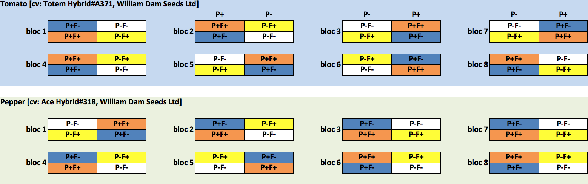

  
\newpage 
```{r table1, echo=F}
library(knitr)
#Table 1
permanova.summary = read.table("../results/permanova.summary")
colnames(permanova.summary) = c("fungi-soil","fungi-root","bacteria-soil","bacteria-root")
kable(permanova.summary,digits =4,caption = "Table 1: summary of PERMANOVAs")
``` 

$r^2$ (percentage of variance explained by the term in the model); *\*p-value<0.05, \*\*<0.005,  \*\*\*<0.0005*  
 
\newpage 
{width=600px}  
**Figure 1: Measures of plant productivity. *a* and *b* subscripts above boxplots denote significant differences according to the fertilization treatment. Fold changes between the mean of the control and fertilized plants were also noted for significant changes (for pepper and tomato separately).**  
&nbsp;  
&nbsp;  
&nbsp;  
{width=700px}  
**Figure 2: Barplots of the relative abundance of fungal ASVs for fungi**  
&nbsp;
&nbsp;  
&nbsp;  
{width=700px}  
**Figure 3: Barplots of the relative abundance of bacterial ASVs for bacteria**  
&nbsp;
&nbsp;  
&nbsp;  
{width=600px}  
**Figure 4: Boxplot of $a$-diversity according to the treatment, species and planting effect for fungal-root, fungal-soil, bacteria-soil and bacteria-root. *a* and *b* subscripts above boxplots denote significant differences.**  
&nbsp;  
&nbsp;  
&nbsp;  
{width=600px, dpi=700}  
**Figure 5: Canonical correspondence analyses for soil-fungi and root-fungi. Samples were labeled and colored in gray (unfertilized) or dark yellow (fertilized). Red crosses represent individual ASVs, while red points represent the ten ASVs most closely associated with the three productivity measures of root fresh weight, shoots fresh weight and fruit number. Blue arrows are the four productivity measures used as constraints in the ordinations.** 
&nbsp;  
&nbsp;  
&nbsp;  
{width=600px, dpi=700}  
**Figure 6: Canonical correspondence analyses for soil-bacteria and root-bacteria. Samples were labeled and colored in gray (unfertilized) or dark yellow (fertilized). Red crosses represent individual ASVs, while red points represent the ten ASVs most closely associated with the three productivity measures of root fresh weight, shoots fresh weight and fruit number. Blue arrows are the four productivity measures used as constraints in the ordinations.** 
&nbsp;  
&nbsp;  
&nbsp; 
&nbsp;  
&nbsp; 
&nbsp;  
\newpage 
```{r tableS1, echo=F}
library(knitr)
#Table S1
permanova.summary = read.table("../results/nutrients.csv",sep = ",", header = T)
colnames(permanova.summary) = sub("."," ",colnames(permanova.summary),fixed =T)
kable(permanova.summary,digits =4,caption = "Table S1: Soil characteristics (in ppm unless specified otherwise)")
```

&nbsp;  
&nbsp;  
&nbsp;  
\newpage   
{width=650px}  
**Table S2: Randomized Split Block Experimental design**  

  
&nbsp;  
&nbsp;  
&nbsp;  
\newpage   
```{r tableS3, out.width = "80%", fig.cap = "Table S2: Stella Maris® characteristics", echo = F}
library(knitr)
#Table S3
table_S3 = read.table("../results/TableS2_StellaMarisCaracteristics.txt",sep = "\t")
colnames(table_S3) = c("Stella Maris® characteristics","Average value")
kable(table_S3,digits =4, caption = "TableS3: Stella Maris® characteristics")
``` 
  
&nbsp;  
&nbsp;  
&nbsp;  
\newpage 
```{r tableS4, echo=F}
library(knitr)
#Table S4
summary.table=read.table("../results/summary.table",header = T,row.names = 1)
colnames(summary.table)[2] = "Nb_seq_sum"
summary.table[,2] = summary.table[,2]*1000
summary.table=t(summary.table[c(4:1),])
summary.table[1,] = c(192,96,192,96)
summary.table = summary.table[c(2:6,1,9,8,10,7),]
rownames(summary.table) = c("No sequences (sum)","No sequences (mean)","No seq. filtered (mean)","No seq. filt. merged (mean)","No seq. filt. merg. no chimeras (mean)","No samples","No samples trimmed","No ASVs (sum)","No ASVs trimmed (sum)","ASV per sample (mean)")
kable(summary.table,format.args=list(big.mark = ','), digits =4,caption = "Table S4: Summary of sequencing and bioinformatics identification of ASVs")
```
  
&nbsp;  
&nbsp;  
&nbsp; 
{width=500px}  
**Figure S1: Plant productivity. Photos were taken at the end of the experimental treatment. In each photo, fertilized plants are on the left. A: pepper shoots, B: pepper roots, C: pepper fruits and D: tomato fruits.**  
&nbsp;  
&nbsp;  
&nbsp;  
{width=500px, dpi=500}  
**Figure S2: Neighbor-Joining trees of candidates ASVs (fungi) positively associated with productivity measures. The most accurate taxonomy assigned according to the RDP bayesian classifier (form Phylum to species) was added as tip labels.** 
&nbsp;  
&nbsp;  
&nbsp;  
{width=500px, dpi=500}  
**Figure S3: Neighbor-Joining trees of candidates ASVs (bacteria) positively associated with productivity measures. The most accurate taxonomy assigned according to the RDP bayesian classifier (form Phylum to species) was added as tip labels.** 
&nbsp;  
&nbsp;  
&nbsp;  


